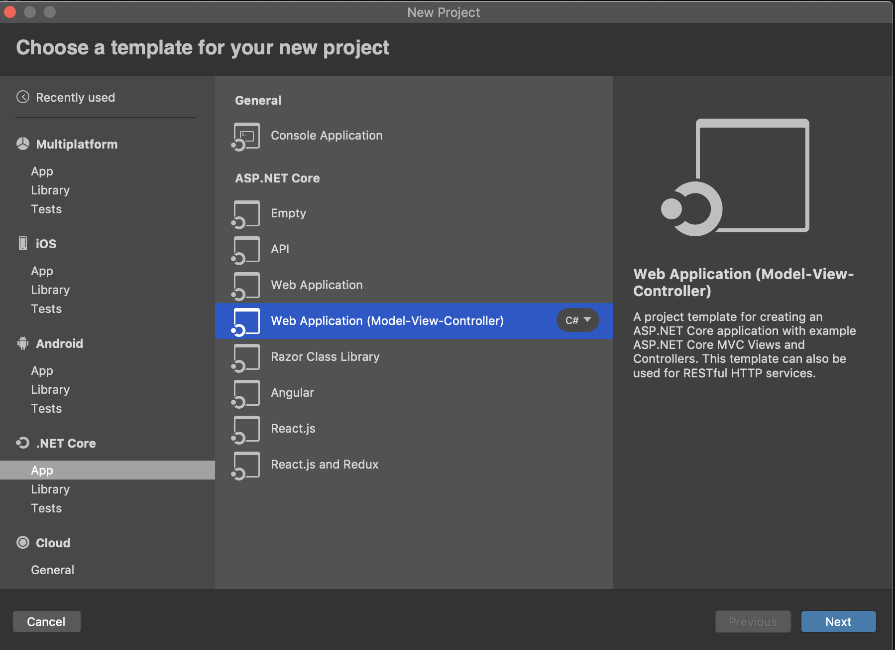
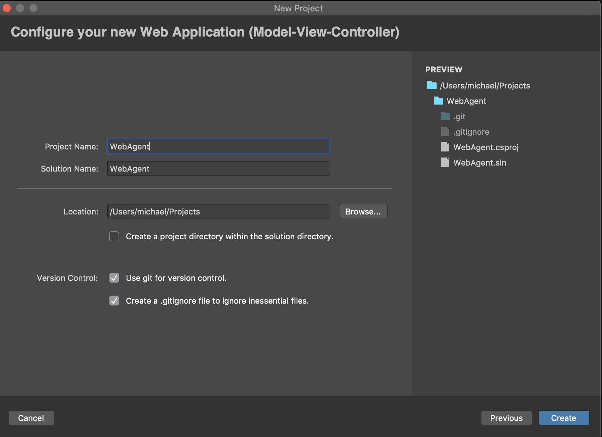

*********************
Getting Started Guide
*********************

Creating a New Project
+++++++++++++++++++++++++++++

This getting started guide will show you how to create a custom AspNetCore web application and 
use the agent framework to create connections and send basic messages. We are going to start from scratch. All you need to have installed in Visual Studio and the .NET Core SDK. 

Prerequisites
=====================================

If you haven't already done so, install Visual Studio community and the .NET Core 2.2.300 SDK
 - `Install Visual Studio <https://docs.microsoft.com/en-us/visualstudio/install/install-visual-studio?view=vs-2019>`_
 - `Install .NET Core SDK 2.2 <https://dotnet.microsoft.com/download/dotnet-core/2.2>`_

You should be running an instance of Windows or MacOS for this particular demo. 

---------------------

Create an AspNetCore Project
===============================

Open Visual Studio and select new project, then choose Web Application (Model-View-Controller):

Select the .NET Core 2.2, then name your project WebAgent.

----------------------

Installing the Required Packages
================================

Use one of the three methods below to load the AgentFramework.Core packages into your project using nuget.

**Package Manager CLI:**

.. code-block:: bash

    Install-Package AgentFramework.Core -Source https://www.myget.org/F/agent-framework/api/v3/index.json -v 4.0.0-preview.662

**.NET CLI:**

.. code-block:: bash

    dotnet add package AgentFramework.Core -s https://www.myget.org/F/agent-framework/api/v3/index.json -v 4.0.0-preview.662
    
NOTE: For these first two CLI options, make sure to install ``AgentFramework.AspNetCore`` and ``AgentFramework.Core.Handlers`` by replacing the package name above with these two names as well. 

**Visual Studio Nuget Package Manager:**

 - click on your new project WebAgent in the side bar
 - go to the project tab in your menu, select ``add nuget packages...``
 - click on the dropdown that says nuget.org, and select ``configure sources...``
 - click add, and then name the new source ``Agent Framework Beta`` and paste the url ``https://www.myget.org/F/agent-framework/api/v3/index.json`` into the location field. 
 - check the ``show pre-release packages`` box on the bottom left
 - choose the ``Agent Framework Beta`` source from the dropdown
 - select the AgentFramework.AspNetCore package from the list. Make sure it is on a 4.0.0 version
 - click add. 

 We will also use one other package from Nuget called ``Jdenticon``. Add that from the nuget.org repository list.

---------------

Installing the libindy SDK on your computer
===========================================

Windows
~~~~~~~

You can download binaries of libindy and all dependencies from the `Sovrin repo
<https://repo.sovrin.org/windows/libindy/>`_. The dependencies are under ``deps`` folder and ``libindy`` under one of streams (rc, master, stable). There are two options to link the DLLs

- Unzip all files in a directory and add that to your PATH variable (recommended for development)
- Or copy all DLL files in the publish directory (recommended for published deployments)

More details at the `Indy documentation for setting up Windows environment
<https://github.com/hyperledger/indy-sdk/blob/master/docs/build-guides/windows-build.md>`_.

MacOS
~~~~~

Check `Setup Indy SDK build environment for MacOS
<https://github.com/hyperledger/indy-sdk/blob/master/docs/build-guides/mac-build.md>`_.

Copy ``libindy.a`` and ``libindy.dylib`` to the ``/usr/local/lib/`` directory.

-------------------

Configuring your own Agent
==========================

In this section, we'll walk through some sections of the WebAgent sample to understand how the AgentFramework can be used in a running application. 

The WebAgent sample was created using the same steps as listed above. It may help to follow along to the steps below in your own new project.
However, you may want to also open and try to run the fully working WebAgent sample in Visual Studio first to see if all the dependancies are working as they should.
When the project was created, ``Startup.cs`` and ``Program.cs`` files were built using a template. These control how your webserver starts. We will need to
edit them to use the agent framework.  

-------------------

Startup.cs
~~~~~~~~~~

Our first goal is to edit the Startup file. Copy and paste the below code into your ``Startup.cs`` file: 

.. container:: toggle
    
    .. container:: header

      **Startup.cs (click to show/hide)**

    .. literalinclude:: ../samples/aspnetcore/Startup.cs
        :language: csharp 
        :emphasize-lines: 32-41, 44-45, 64, 72
        :linenos:

In this file, we congigure and add the Agent Framework to the project. If you are building the project from scratch, 
make sure to comment out lines 44-45 until you have created these services. Line 72 specifies how the API to trigger actions should be called.
-------------

Program.cs
~~~~~~~~~~

Next, we will edit the ``Program.cs`` file. Copy and paste this code too: 

.. container:: toggle
    
    .. container:: header

      **Program.cs**

    .. literalinclude:: ../samples/aspnetcore/Program.cs
        :language: csharp 
        :linenos:

Once you have finished with this code, take a moment to look over the changes that we've made. 

----------------

SimpleWebAgent.cs
~~~~~~~~~~~~~~~~~
Now create a file name ``SimpleWebAgent.cs`` in the main directory

This file will inherit from the AgentBase class in the AgentFramework, and it extends the IAgent Interface. 
This interface includes only one function named ``Task<MessageResponse>ProcessAsync(IAgentContext context, MessageContext messageContext)``
This will process any message that is sent to the agent's endpoint. 

Copy and paste the below code into the file:

.. container:: toggle
    
    .. container:: header

      **SimpleWebAgent.cs (Click to show)**

    
    .. literalinclude:: ../samples/aspnetcore/SimpleWebAgent.cs
        :language: csharp 
        :linenos:

-----------

bundleconfig.json
~~~~~~~~~~~~~~~~~

Create a bundleconfig.json file in your project root directory, and paste this json array into to it: 

.. container:: toggle
    
    .. container:: header

      **bundleconfig.json** 
    
    .. literalinclude:: ../samples/aspnetcore/bundleconfig.json
        :language: javascript 
        :linenos:

-------------------------

launchSettings.json
~~~~~~~~~~~~~~~~~~~

Edit the ``Property/launchSettings.json`` 

.. container:: toggle
    
    .. container:: header

      **launchSettings.json**

    .. literalinclude:: ../samples/aspnetcore/Properties/launchSettings.json
        :language: javascript 
        :linenos:

Finally, to get this program to run we will need to add a couple of utility files. 

First, add a Utils folder. Add these two files to the Utils folder (Open these links in new tabs): 

`NameGenerator.cs <https://raw.githubusercontent.com/streetcred-id/agent-framework/master/samples/aspnetcore/Utils/NameGenerator.cs>`_
`Extensions.cs <https://raw.githubusercontent.com/streetcred-id/agent-framework/master/samples/aspnetcore/Utils/Extensions.cs>`_

--------------

Click run, you should see your template home page will appear in your web browser at http://localhost:5000. Congratulations! You've successully included the Agent framework into your project. Continue on to see how you might use it in your project.

WebAgent Walkthrough
+++++++++++++++++++++

We will learn how to create a web agent in this section. If you have created your own agent, you should be able to use that here. You may want to download the `View files <https://github.com/streetcred-id/agent-framework/tree/master/samples/aspnetcore/Views>`_ and import them into your project to save time on copy/paste:  
We're assuming that you are already familiar with the high level concepts of Indy and Sovrin. 

The first thing is to understand about Wallets. Read about wallets here:  
**Insert link/paragraphs about wallet infra based on hipe:** `Wallet HIPE <https://github.com/hyperledger/aries-rfcs/blob/master/concepts/0050-wallets/README.md>`_

-----------

Opening a wallet in Agent Framework
====================================

We open a wallet in Agent Framework by provisioning an agent. This process of provisioning 
agents will create and configure an agent wallet and initialize the agent configuration.
The framework will generate a random Did and Verkey, unless you specify ``AgentSeed`` 
which is used if you need determinism. Length of seed must be 32 characters. 

.. code-block:: csharp 

    await _provisioningService.ProvisionAgentAsync(
        new ProvisioningConfiguration
        {
            EndpointUri = "http://localhost:5000",
            OwnerName = "My Agent"
        });

We provision this agent in the ``Startup.cs`` file by building it directly with the AgentBuilder 

.. container:: toggle
    
    .. container:: header

      **HomeController.cs (Show)** 

    .. literalinclude:: ../samples/aspnetcore/Startup.cs
       :language: csharp
       :emphasize-lines: 32-41
       :linenos:

You now have a functioning wallet in your agent, ready to store all your secrets. 

-----------------

The Agent framework abstracts the main workflows of Indy into a state machine. For our agent, we will show how to create and receive invitations with other people. 
Although simple, it builds the foundation for all other potential agent communications like credentials and proofs. 

TODO: Basic message and routing info 

Connections
==============

Every connection is a unique relationship with another agent. The Agent Framework represents this relationship with a ``ConnectionRecord``, this entity describes the pairwise relationship with another party.
The states for this record are:

- ``Invited`` - initially, when creating invitations to connect, the record will be set to this state.
- ``Negotating`` - set after accepting an invitation and sending a request to connect
- ``Connected`` - set when both parties have acknowledged the connection and have a pairwise record of each others DID's

For us to send basic messages back and forth, we will first need to establish that protocol. We will walk through how a message is processed in the WebAgent.

First, we need to define the basic message structure in the Protocols folder. These are all child classes of the AgentMessage class that is in the AgentFramework. 

.. container:: toggle
    
    .. container:: header

      **AgentMessage.cs (Show)** 

    .. literalinclude:: ../src/AgentFramework.Core/Messages/AgentMessage.cs
       :language: c#
       :linenos:

The BasicMessage uses the AgentMessage attributes as shown in the class above but adds "content" and "sent_time" attributes as well. This will allow something like text messages to be sent between agents. 

.. container:: toggle
    
    .. container:: header

      **BasicMessage.cs (Show)** 

    .. literalinclude:: ../samples/aspnetcore/Protocols/BasicMessage/BasicMessage.cs
       :language: csharp
       :emphasize-lines: 16-20
       :linenos:

When your agent receives a message, it gets put directly into the wallet by the basic message handler. 

.. container:: toggle
    
    .. container:: header

      **BasicMessageHandler.cs (Show)** 

    .. literalinclude:: ../samples/aspnetcore/Protocols/BasicMessage/BasicMessageHandler.cs
       :language: csharp
       :emphasize-lines: 22-29
       :linenos:

Then when the view is reloaded, the Controller class takes over. 

This is following the MVC pattern of ASPNetCore. 

Here is the ConnectionsController class that will show a BasicMessage if one is sent or received: 

.. container:: toggle
    
    .. container:: header

      **ConnectionsController.cs (Show)** 

    .. literalinclude:: ../samples/aspnetcore/Controllers/ConnectionsController.cs
       :language: csharp
       :emphasize-lines: 133, 153
       :linenos:

Read through the rest of the ConnectionsController class to understand how the Agent Framework can be used to implement the other website features. 
